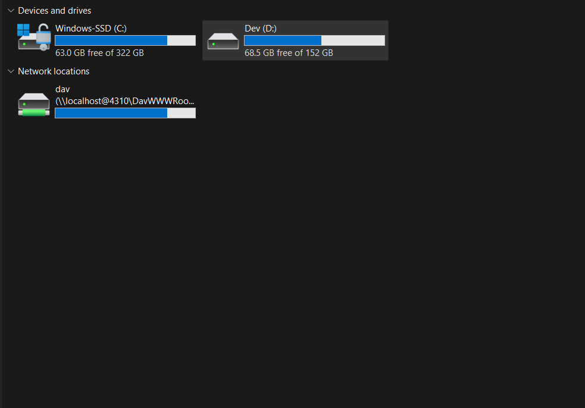
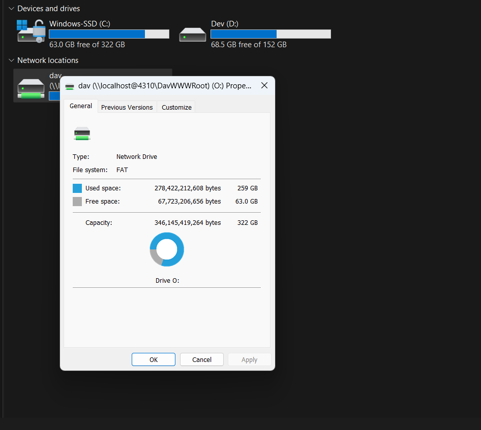

# OmniDisk

A local-first router that fragments files across multiple free-tier cloud
storage accounts, so your effective free space is the sum of every account
you connect.

## Screenshots

<!--
  Put the screenshots in the `img/` folder at the root of the repo, using
  these exact file names (or edit the paths below). GitHub renders relative
  paths from the README, so nothing else is needed.
-->

| Dashboard | File Explorer |
| :---: | :---: |
|  |  |
|---|---|


## About this build

This started as the **Phase 0 skeleton** — the local web app boots, the
metadata database and credential vault work, the priority manager and the
core fragmentation/routing algorithm are fully implemented and tested, and
the REST API + dashboard UI are wired end-to-end.

**Phase 1 is well underway:** three concrete `ProviderAccountBase`
adapters exist in `server/providers/` — `MegaAccount`, `GoogleDriveAccount`,
and `SupabaseAccount` — and are wired into `AccountRegistry` both at server
startup (accounts saved in a prior session reconnect automatically) and
immediately after a new account is added via `POST /api/providers/mega/accounts`,
`POST /api/providers/supabase/accounts`, or the Google Drive OAuth flow.
Every other provider in the catalog (OneDrive, Dropbox, Box, pCloud, GitHub,
GitLab, R2, B2, S3, Azure, GCS, WebDAV) still has no adapter, so accounts
for those remain "saved but not connected" exactly as before — see
`server/providers/adapter-factory.ts`, the single place that needs a new
`case` when the next adapter lands.

Google Drive's OAuth flow is fully real end-to-end, including the frontend:
`AddProviderModal` full-page-navigates the browser to the `consentUrl`
returned by `POST /api/providers/google_drive/connect`; Google redirects
back to `GET /api/providers/google_drive/oauth-callback` (a route on this
same server — see the setup guide for why the OAuth client must be a
**Web application** type, not Desktop, with that exact URI registered),
which exchanges the code, registers the live adapter, and redirects the
browser on to the dashboard.

Also worth knowing: `planAllocation` (in `fragment-router.ts`) now actually
enforces `maxSingleObjectBytes` — an account's allocation is split into
multiple ≤-cap fragments instead of one oversized one. This was a real gap
(the field existed on several registry entries but was never read) that
Supabase Storage's hard 50MB/file limit forced fixing properly rather than
working around per-adapter.

On top of that, the **provider registry & catalog UI** is fully built: a
data-driven "Add a provider" flow covering all 15 supported providers,
driven entirely by `server/core/provider-registry.ts` — no per-provider
form code. This includes the app-level vs. account-level credential split
(one Google Cloud app authorizes any number of Drive accounts), the
billed-provider guardrail (S3/Azure/GCS default to disabled), and the
credential vault's OS-keychain-with-encrypted-file-fallback. What's still
missing is the concrete adapter behind each provider — `connect`/`accounts`
register real DB rows and reserve credential slots, but there's no live
OAuth consent screen or API validation call yet, since that requires an
adapter to validate against.

## Open decisions this build assumed (spec section 15)

These were picked using the spec's own stated recommendations, since no
answer was given yet. Revisit `docs/OmniDisk_MasterSpec.md` §15 if you'd
rather go a different way:

1. **Local web app**, not Electron, for Phase 0/1.
2. **Raw `better-sqlite3`**, not an ORM, for the skeleton stage.
3. **Chunk size default: 8MB** (configurable in Settings).
4. First two provider adapters to build in Phase 1 are still open — nothing
   here depends on which two you pick.

## Project layout

```
server/          Fastify API, SQLite metadata store, core routing algorithm
  core/          models, fragment-router, priority-manager, compression,
                 provider-account-base (the adapter contract), account-registry,
                 provider-registry (the 15-provider catalog), ingest (the shared
                 upload/delete pipeline used by both the REST API and WebDAV)
  db/            schema.sql, client.ts (AppData resolution + column migrations), repository.ts
  security/      credential-vault.ts (OS keychain / encrypted-file fallback)
  api/           Fastify server + route modules (routes/dav.ts = the WebDAV mount)
  providers/     empty — concrete adapters land here in Phase 1
web/             Vite + React + Tailwind dashboard (Dashboard, File Explorer, Settings)
  src/components/ProviderCatalogGrid.tsx, DynamicProviderForm.tsx, AddProviderModal.tsx
                 — the catalog-driven "Add a provider" flow
tests/
  unit/          allocation algorithm, compression roundtrip, priority manager
  integration/   full upload -> fragment -> store -> retrieve -> download cycle,
                 provider catalog / app-config / connect / accounts routes,
                 WebDAV protocol + REST interoperability
  helpers/       MockProviderAccount — in-memory adapter, no network calls
```

## Running it

```bash
npm install

# Terminal 1 — API server on http://127.0.0.1:4310
npm run dev:server

# Terminal 2 — dashboard on http://localhost:5173 (proxies /api to the server)
npm run dev:web
```

### Running it on Google Colab

See [`colab/README.md`](./colab/README.md) — a single self-contained script
(`colab/run_omnidisk_colab.py`) mounts Drive, installs everything, builds
the frontend, and serves the whole app (frontend + API, one port) behind a
Colab-provided public URL. This is also why `server/api/server.ts` can now
serve `web/dist` directly (`OMNIDISK_DATA_DIR` and `OMNIDISK_PUBLIC_URL` env
vars support this single-port, Drive-backed mode; both are no-ops for the
normal two-terminal local setup above).

### Mounting it as a drive (WebDAV)

With the server running (`npm run dev:server`), OmniDisk exposes its virtual
folder tree at `http://localhost:4310/dav` (Virtual Drive Spec §3.1, Phase 4).
Anything you copy in goes through the same block/compress/route pipeline as
the web UI's upload, and anything you open is read through the block cache,
so the drive and the dashboard always show the same files.

**Windows** (PowerShell):

```powershell
net use O: http://localhost:4310/dav
# to remove it later:
net use O: /delete
```

Or in Explorer: *This PC → Map network drive… → Folder:* `http://localhost:4310/dav`.

If `net use` fails with **System error 67 ("The network name cannot be
found")**, work down this list. Error 67 is Windows' generic answer for "I
couldn't complete a WebDAV handshake with that URL", so the cause is one of:

1. **The server isn't running.** Check from the same PowerShell window:
   `curl.exe -i -X OPTIONS http://localhost:4310/dav` should print
   `DAV: 1, 2`. If it can't connect, start the server first.
2. **The WebClient service is stopped or disabled.** Windows' built-in
   WebDAV support *is* that service. From an **admin** PowerShell:
   `sc.exe query WebClient`, then `net start WebClient`. If it reports the
   service is disabled: `sc.exe config WebClient start= demand`, then start it.
3. **`localhost` resolves to IPv6 (`::1`) but the server listens on IPv4
   only.** Try `net use O: http://127.0.0.1:4310/dav`.
4. **A system proxy is intercepting the request.** `netsh winhttp show proxy`
   should say "Direct access". If not, add `localhost;127.0.0.1` to the
   bypass list.

**Windows' 50 MB file limit.** The built-in client refuses to download files
larger than ~50 MB by default ("The file size exceeds the limit allowed").
Raise it (admin PowerShell) and restart the service:

```powershell
reg add HKLM\SYSTEM\CurrentControlSet\Services\WebClient\Parameters /v FileSizeLimitInBytes /t REG_DWORD /d 4294967295 /f
net stop WebClient; net start WebClient
```

**macOS:** Finder → Go → Connect to Server → `http://localhost:4310/dav`.
**Linux:** `gio mount dav://localhost:4310/dav` (GVFS), or
`sudo mount -t davfs http://localhost:4310/dav /mnt/omnidisk` (davfs2).
**Any OS, real drive letter / mountpoint:** `rclone mount` pointed at the
same URL (`vendor=other`) gets you a true filesystem via WinFsp/FUSE — the
spec's Phase 5 shortcut.

What works: browse, open (with random-access ranged reads), copy in/out,
create/rename/move/delete files and folders, real free-space reporting.

**Free space shown for the drive.** Windows/Finder work out a drive's size as
*available + used*, so OmniDisk reports one consistent pool: the summed quota of
your connected accounts (two 20 GB MEGA accounts = 40 GB) and how much of it is
already taken. "Taken" is what the providers report, so it includes anything
else you keep in those accounts, not just OmniDisk's own blocks. The figures are
read from the providers (cached for a minute) and fall back to the last saved
values if a provider doesn't answer. If you still see your *local* disk's
numbers, Windows may be showing a cached or fallback value: `net use O: /delete`, restart the WebClient
service (`net stop WebClient & net start WebClient`) and map the drive again.
To see exactly what the server reports:

```powershell
curl.exe -s -X PROPFIND -H "Depth: 0" -H "Content-Type: text/xml" `
  -d '<D:propfind xmlns:D="DAV:"><D:prop><D:quota-available-bytes/><D:quota-used-bytes/></D:prop></D:propfind>' `
  http://127.0.0.1:4310/dav/
```

**When a copy fails.** A `PUT` now succeeds (`201`/`204`) only if every block
really reached its provider. If a provider rejects the upload the server answers
`502` (or `507` when the provider says the account is full) with the provider's
own message in the response body, removes whatever part of the file was
written, and leaves any file you were overwriting untouched. The same message is
logged in the server console as `WebDAV PUT rejected by provider — ...`, which is
the first place to look when Explorer shows a vague error such as *"The file size
exceeds the limit allowed"*. For a file well under Windows' 50 MB limit, that wording
is unlikely to be about size; check the server log for the real reason.
What doesn't (yet), by design or by scope:

- **No authentication** — it relies on the localhost-only bind, like the rest
  of the API. Windows also refuses Basic auth over plain HTTP by default, so
  adding auth means moving the endpoint to HTTPS first.
- **Writes need at least one *connected* provider account** (one with a live
  adapter — see the note above about which providers have adapters). Reads
  and browsing work regardless. Without one, `PUT` answers `507`.
- **`PUT` is synchronous**: it responds only after every block is stored at
  its provider. Big files on slow providers can outlast Windows' WebDAV
  timeout — the write-back cache in the Virtual Drive Spec §4 is the proper
  fix (acknowledge once staged locally, flush in the background).
- **Uploads are buffered in memory** (inherited from the upload pipeline), so
  raising the 50 MB limit far past your free RAM is not a good idea yet.
- **Server-side `COPY` returns 501.** Explorer copies client-side (GET+PUT),
  so ordinary copy/paste still works.
- Locks (`LOCK`/`UNLOCK`) are accepted so Office will save, but not enforced.

## Running the tests

```bash
npm test
```

Covers the overflow-fill allocation algorithm (exact fit, multi-account
spillover, insufficient-space abort-before-network-call, capacity-exhausted
skip), compression roundtrips, priority-manager ranking across all four sort
modes, and a full mock-provider upload/download integration cycle with
checksum verification, and the WebDAV layer (protocol handshake, ranged
reads across block boundaries, rename/move/delete, recursive folder delete,
and REST-upload/WebDAV interoperability).

## What's next (Phase 1, continued)

`MegaAccount` and `GoogleDriveAccount` are done (see above). Remaining:

1. Wire `AddProviderModal`'s "Connect" button for Google Drive to open the
   returned `consentUrl` and run a local loopback listener on
   `127.0.0.1:53682/oauth/callback` that posts the `code` to
   `/api/providers/google_drive/oauth-callback`.
2. Add the next `S3CompatibleAccount` adapter (shared base for R2/B2/S3 —
   see provider-setup-guide.md §15) in `server/providers/`, plus a `case`
   for it in `adapter-factory.ts`. Nothing in the router, priority manager,
   or API routes needs to change — that boundary was the point of the
   skeleton, and still holds after two real adapters.
3. Credential rotation (Box/OneDrive's refresh-token-rotates-on-every-use
   behavior) isn't implemented in any adapter yet — MEGA and Google Drive
   don't need it, but it'll matter once those two adapters are built.

The one other stub worth flagging: the credential vault's "user passphrase
prompted once per session" (spec §9) has no session/first-run UI yet, so
the encrypted-file fallback currently uses a locally-generated key file
instead. Wiring in a real passphrase prompt is a drop-in swap.
